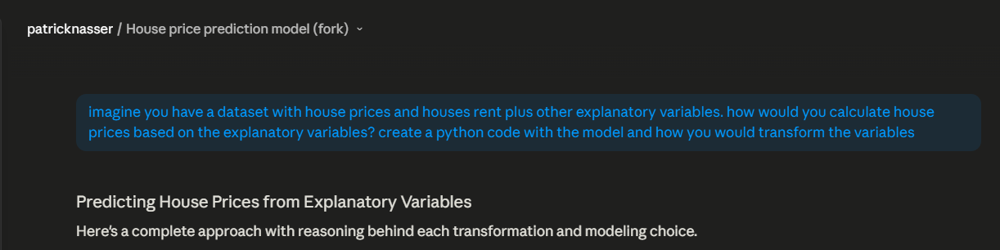
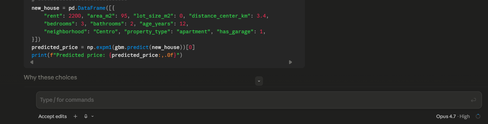

> **TL;DR.** When you fit a regression on $\ln Y$ and exponentiate the prediction back, you get a biased estimate of $Y$ — Jensen's inequality says so. It's a small detail nobody enforces, every codebase I've seen ignores it, and LLMs cheerfully reproduce that habit by default. The problem isn't math, it's the knowledge–practice gap, and the way out is shared context (SKILL files, open-source patterns) that bridges domains the model doesn't know to consult.

## The knowledge–practice gap, amplified

This is a consistent mistake I keep running into while vibe coding common data science problems, and it made me realize how much current LLMs amplify the **knowledge–practice gap** — the distance between what is _known_ in a field and what is actually _done_ day to day.

When training, labs like Anthropic and OpenAI weight their data sources by credibility so the model produces better predictions. Weighting is fragile, though, and that fragility shows up the moment you ask a token-prediction machine to do something where a field's consensus and a field's practice disagree. I see it most clearly with **big numbers**.

## Why we log-transform

Big numbers are ugly to read (unless they're in your bank account). They're also a pain to interpret, and worse to compare — stock prices against inflation, house prices against rentals, that kind of thing. So data scientists, economists, and any data nerd reach for the **log scale**:

- Variance shrinks, so heteroscedasticity stops being a fire.
- Coefficients in log–log or log–level models read directly as % changes.
- Optimizers tend to behave better on heavy-tailed targets.

If we do it, the LLM does it — which is what brought me here. Until here everything is fine, but then comes **the catch**.

## The catch: you can't just exponentiate back

Once you fit a linear model on the log scale, you have a sample estimate of the conditional mean of $\ln Y$:

$$\widehat{\ln Y} = \hat{\beta}_0 + \hat{\beta}_1 X$$

which estimates the population quantity

$$E[\ln Y \mid X] = \beta_0 + \beta_1 X$$

The naive move — what almost everyone does — is to exponentiate it and call that your prediction of $Y$:

$$\hat{Y}_{\text{naive}} = e^{\widehat{\ln Y}} = e^{\hat{\beta}_0 + \hat{\beta}_1 X}$$

In code, that's the two lines you've probably written a hundred times:

```python
model.fit(X, np.log(y))
y_pred = np.exp(model.predict(X_new))   # ← the bias lives on this line
```

But this introduces bias, courtesy of **Jensen's inequality**. The exponential is strictly convex, so for any random variable

$$E[e^{g(X)}] \geq e^{E[g(X)]}$$

with strict inequality whenever there's any real variation in $g(X)$. Applied here:

$$E[Y \mid X] = E[e^{\ln Y \mid X}] \;\geq\; e^{E[\ln Y \mid X]}$$

![Jensen's inequality: the gap between $E[e^X]$ (green) and $e^{E[X]}$ (red) is the bias you inherit by exponentiating naively.](jensen_inequality.png)

In plain English: exponentiating the estimated mean of $\ln Y$ does **not** give you the estimated mean of $Y$. It gives you a biased estimate that **systematically underestimates** the true arithmetic mean and messes up predicted variance. The bias lives in the error term and it doesn't go away with more data.

I won't go through the corrections here. There are several — **Duan's smearing** for the nonparametric route, the **$e^{\hat\sigma^2/2}$ adjustment** if you're willing to assume normal errors — none is perfect, and your favorite LLM can find them faster than I can summarize them.

## What this looks like with an LLM

The problem is: most people don't apply any correction, so the LLM, dutifully following the corpus, doesn't either — unless you tell it to.

In every single place I've worked, I've found people doing the naive conversion without realizing there's a bias. And every single time I asked an LLM to build a model where a log transform was obviously the right call, it did the transform — and then naively transformed the predictions back, with no mention of Jensen.

<figure style="max-width: 480px; margin: 1.5rem auto; text-align: center;">
  
  <figcaption style="font-size: 0.85em; color: var(--hb-color-foreground, #6b7280); margin-top: 0.5rem;">
    <strong>The prompt</strong> — asking Claude to build a model for house prices from a few explanatory variables, and to choose the appropriate transforms.
  </figcaption>
</figure>

<figure style="max-width: 480px; margin: 1.5rem auto; text-align: center;">
  
  <figcaption style="font-size: 0.85em; color: var(--hb-color-foreground, #6b7280); margin-top: 0.5rem;">
    <strong>The answer</strong>, same session — <code>np.expm1</code> quietly bringing the prediction back to price space, with no correction for the Jensen bias.
  </figcaption>
</figure>

## So what do we do?

I don't think there's a clean fix. This is an **epistemic** problem about how we transmit knowledge and how AI reproduces it. The best lever we have is to write **SKILL files** — context the model can read at task time — that bridge the domains the base model doesn't know to consult on its own.

As an open-source advocate I think this gets solved through community, not by labs alone. SKILL files are popping up in different repos every day. Use them. Enhance them. Make sure the AI you're working with has the best context you can give it.

Speeding up the easy stuff is revolutionary. But there's still an opportunity to _close_ the knowledge–practice gap, not widen it — and that's where the real social win is right now.
